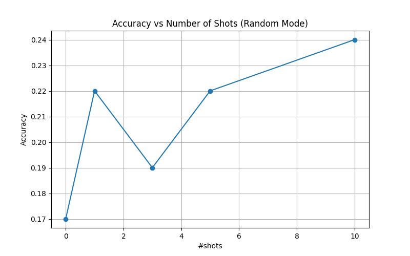

## k-Shot Narrative Classification 

This experiment evaluates the Meta-LLaMA 3.1 8B-Instruct model on narrative classification using few-shot prompting.
We apply **TF-IDF with cosine similarity** to select the most semantically similar examples (shots) from the training set for each test document.
In the next steps , we are going to filter the prompts so as to not lose any important information because of truncation issues
The following figure shows the classification accuracy across different numbers of shots:

## Randomness in samples

After dealing with random shots , we observe a slight drop in  accuracy , as in the similar examples the peak was at 0.27 while in random the peak is at 0.24.
This can be shown in the upcoming figure:
